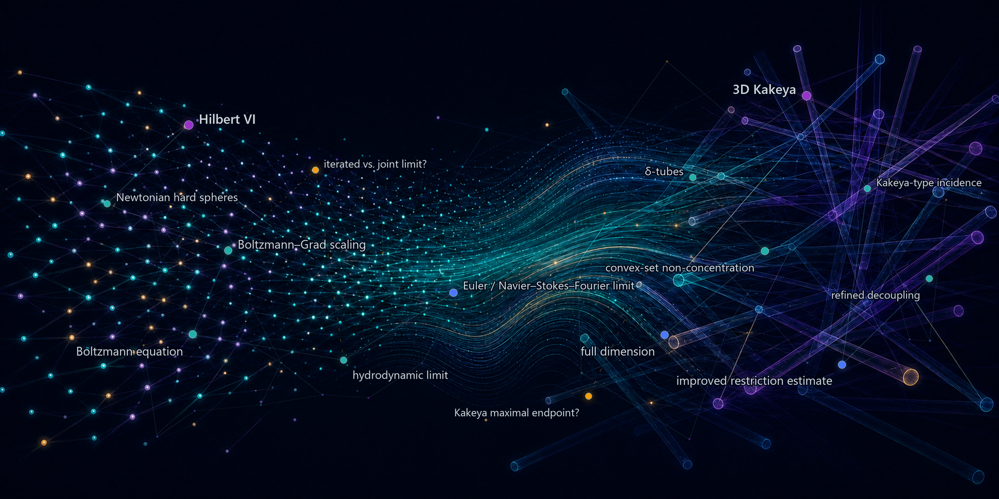
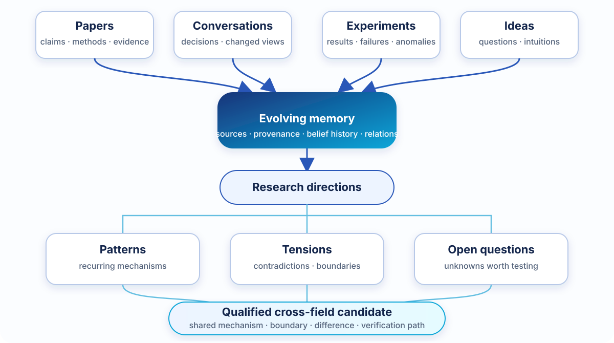
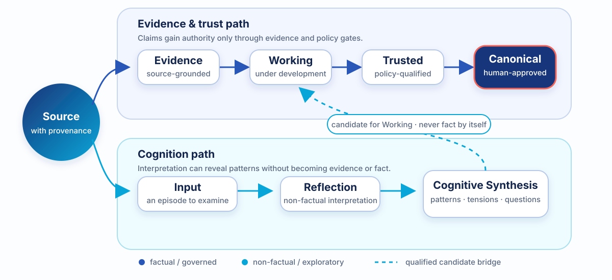

<p align="center">
  
  &nbsp;<strong>Galois</strong>
  &nbsp;&mdash;&nbsp;
  <strong>Find the hidden structure.</strong><br />
  <sub>
    <em>Scientific memory for AI assistants.</em>
    &nbsp;&middot;&nbsp;
    <a href="#connect-your-ai-assistant"><strong>Get started</strong></a>
    &nbsp;&middot;&nbsp;
    <a href="#from-fragments-to-structure">How it works</a>
    &nbsp;&middot;&nbsp;
    <a href="#documentation">Documentation</a>
  </sub>
</p>

<p align="center">
  <a href="./assets/hero/hero-hidden-structure.png">
    
  </a>
</p>

<p align="center">
  <strong>Preserve the fragments, evidence and uncertainty that let structure
  emerge over time.</strong>
</p>

Knowledge rarely arrives as a finished map. It arrives as fragments: a paper,
a contradiction, an intuition, a failed experiment, a question that will not
go away.

| | |
|:---|:---|
| **Trace**<br />Keep the source and its authority. | **Evolve**<br />Record how a belief changes. |
| **Connect**<br />Develop bounded cross-field candidates. | **Question**<br />Turn tensions into testable questions. |

> **The goal is not to remember everything. It is to notice what becomes
> visible when memory has structure.**

Galois does not decide that a pattern is true. The assistant performs the
cognitive work; Galois keeps its sources, boundaries, contradictions and trust
state explicit.

## From fragments to structure

<p align="center">
  
</p>

<p align="center">
  <sub><strong>Fragments</strong> &rarr; evolving memory &rarr; research directions
  &rarr; patterns, tensions and questions &rarr; qualified candidate &rarr; verification</sub>
</p>

A theorem, a robot failure and a thermodynamic argument may be unrelated. Or
they may share a boundary, a scaling law or merely a seductive word. Galois is
designed to retain enough context to tell the difference.

It helps a connected assistant ask questions such as:

- Does the same mechanism appear in two fields, or only the same vocabulary?
- Did new evidence support a belief, limit it, or expose a contradiction?
- Which missing source would turn an attractive analogy into a serious research
  candidate?
- What becomes worth testing once several research directions are seen together?

These are prompts for investigation, not claims of automatic discovery.

## Connect your AI assistant

Galois is designed to be used **through the assistant you already use**, not as
a terminal-first knowledge manager.

After connecting the default read-only gateway, ask naturally:

```text
Use my Galois memory to answer this question. Separate memory evidence,
non-factual synthesis, uncertainty, and your own interpretation.
```

```text
Compare my world-model and reinforcement-learning research directions.
Show any shared mechanism, its boundary, the important difference,
the evidence gap, and the next verification step.
```

```text
What changed in my recent research, and which unresolved tension is now
most worth investigating?
```

> The configurations in this repository are read-only by default. A request
> such as “remember this note” requires an explicit opt-in capture connection
> and clear user intent; it is not part of the default five-tool surface.

### Supported hosts

| Assistant | Integration status |
|---|---|
| Claude Desktop | Windows installer and read-only MCP template; live validated |
| Codex | Read-only MCP template; live validated on Windows |
| Hermes | Read-only MCP fragment; host-prefixed tool names are expected |
| OpenClaw | Use its managed MCP CLI or Control UI with the reviewed server fragment |
| OpenHuman | Supports a static MCP bridge or a dynamic Registry, depending on the build |
| Other assistants | Compatible local `stdio` MCP clients; verify the mapping live |

Current templates are **machine-path-neutral Windows templates**, not a claim
of completed macOS/Linux onboarding. They live with the machine-readable
acceptance contract in [`adapters/hosts/`](adapters/hosts/).

### Let your assistant perform the integration

Give the assistant this repository and send:

```text
Read README.md and adapters/hosts/galois.mcp-manifest.json. Connect this
assistant to Galois using its native MCP configuration command or registry
when available; otherwise merge the matching template. Discover the actual
repository, Python runtime, host version, operating system, and config path.
Back up the config and preserve unrelated settings. Keep Galois read-only.

Restart the host if required. Prove the live connection by calling
memory_capabilities, checking that the server-level tools/list surface is the
five required memory_* tools, and running one bounded non-ASCII memory_context
query (for example, in Chinese). The host may prefix or wrap tool names, but
the mapping must remain one-to-one and expose no write tools. Static config or
subprocess startup is not proof of success. If this is not Windows, or the
installed host uses an unknown registration path, stop and report the concrete
compatibility gap.
```

The server-level read surface is exactly:

`memory_capabilities`, `memory_context`, `memory_search`, `memory_show`,
`memory_source`.

Hermes may expose prefixed names. OpenHuman's static bridge may expose these
through `mcp_list_tools` and `mcp_call_tool`. That namespacing is acceptable
only when it maps one-to-one to the five server tools and adds no write surface.

<details>
<summary><strong>One-time local setup</strong></summary>

<br />

Python 3.11-3.13 is supported.

```bash
git clone https://github.com/bhneo/global_memory.git
cd global_memory
python -m pip install -e ".[pdf]"
galois --help
```

For Claude Desktop on Windows:

```powershell
.\scripts\install-galois-claude-desktop.ps1
```

For other validated Windows hosts, use the host's managed MCP command or merge
the matching template from [`adapters/hosts/`](adapters/hosts/). Replace both
template variables with discovered absolute paths; never copy another user's
paths.

All current public commands and new host registrations use **`galois`**. The
old short launcher is a deprecated migration shim and is intentionally absent
from current instructions. The Python module name inside an MCP transport
configuration is an internal compatibility detail, not a user command.

</details>

## How cognition remains honest

**The assistant performs the cognition.** Galois does not call a model inside
the memory core. A connected assistant reads, compares, reflects and
synthesizes. Galois supplies bounded context, validates governed artifacts,
preserves provenance and applies only permitted writes.

**Daily reflection** digests a bounded set of new Inputs. Every selected
candidate receives an explicit disposition:

`create` &middot; `update` &middot; `reuse` &middot; `remain source-only` &middot;
`require review` &middot; `defer`

This makes the disposition of each selected candidate visible and auditable.

**Direction synthesis** follows durable research directions rather than
calendar weeks. It asks: *What changed here, and what remains unresolved?*

**Cross-direction synthesis** is a qualified candidate workflow. A proposed
connection must state its shared mechanism, boundary, difference,
counterarguments, evidence gap and verification path. Producing zero
connections is a valid result. The current live vault has direction-level
syntheses but no accepted active cross-direction synthesis yet.

## Trust without killing creativity

Creativity and factual authority travel on different paths:

<p align="center">
  
</p>

<p align="center">
  <sub><strong>Evidence path:</strong> Source &rarr; Evidence &rarr; Working &rarr;
  Trusted &rarr; human-approved Canonical<br />
  <strong>Cognition path:</strong> Source &rarr; Input &rarr; Reflection &rarr;
  Synthesis &#8669; candidate for Working, never fact by itself</sub>
</p>

| Layer | Meaning |
|---|---|
| **Source / Input** | Captured material with provenance; not knowledge merely because it was retrieved |
| **Reflection / Synthesis** | Non-factual cognitive artifacts that can reveal patterns and tensions |
| **Working** | Active knowledge under development |
| **Trusted** | Evidence-backed and policy-qualified knowledge |
| **Canonical** | Knowledge explicitly promoted with user approval |
| **Historical** | Superseded material retained for audit, not a default conclusion |

Questions, analogies, anomalies and hypotheses can remain useful without being
mislabeled as facts. Execution requests exclude raw and non-factual layers and
apply stricter Receipt, entailment and policy checks.

## Agent Memory Gateway

Connected assistants receive bounded Evidence Packets through MCP. The default
gateway can expose:

- research context with visible truth and trust metadata
- bounded search and individual memory objects
- bounded captured source and existing extraction text
- contradictions, evidence gaps and execution blockers

An opt-in gateway can additionally expose explicit-consent capture, session,
use and feedback signals. It is not the default and cannot promote Trusted or
Canonical memory.

## Why Galois?

| Typical AI memory | Galois |
|---|---|
| Stores extracted facts or chat summaries | Preserves Sources, evidence, interpretation and belief history |
| Retrieves similar text | Returns bounded, governed research context |
| Overwrites yesterday's answer | Records support, refinement, limits, contradiction and supersession |
| Rewards attractive analogies | Requires mechanism, boundary, difference and a verification path |
| Uses one context mode for everything | Separates research, exploration and strict execution |
| Belongs to one assistant | Can serve several assistants through one governed memory |
| Treats model confidence as authority | Keeps Canonical promotion under explicit human control |

## Current capabilities

| Memory | Cognition | Integration |
|---|---|---|
| Local-first Markdown truth layer | Agent-driven Daily Reflection | Read-only MCP for multiple assistants |
| Immutable Raw / Source capture | Direction-scoped Cognitive Synthesis | Obsidian views and typed-relation graph |
| Working / Trusted / Canonical / Historical | Qualified cross-direction candidate workflow | Recovery, migration and drift audit |
| Evidence and provenance tracking | Falsifiable hypothesis gates | Research / exploration / execution profiles |
| Explicit belief evolution | Evidence-bounded connections | Doctor, lint and integrity checks |

## What Galois is not

- Not an automatic truth machine
- Not a generic note-taking app or vector database wrapper
- Not a general Agent runtime or multi-Agent orchestrator
- Not an automatic experiment executor
- Not a replacement for primary sources
- Not a system that turns every analogy into a discovery

## Data ownership and release boundary

Each user builds and owns a separate Galois vault through capture and governed
cognitive consolidation. **The formal open-source distribution will include
the engine, protocols, adapters, tests and optional synthetic fixtures—not this
project's research vault or any user's knowledge.**

This temporary evaluation repository currently carries a live multi-domain
vault so web-based models can inspect the complete system. That is an explicit
evaluation exception, not the intended release layout. The later release must
use a non-destructive, allowlisted export and clean-history verification so
private knowledge can be excluded without changing runtime behavior.

“Local-first” describes storage and ownership, not a promise that a connected
cloud model never receives data. Galois sends bounded context, but anything
sent to a cloud assistant remains subject to that provider's privacy and
retention terms.

## Project status

Galois is experimental research infrastructure actively used with a real,
multi-domain research vault. Before a formal open-source release, remaining
work includes:

- a private-vault-safe release pipeline and clean-history verification
- optional synthetic demonstration fixtures
- reproducible reflection and synthesis examples
- public evaluations and cross-platform onboarding

## Documentation

| | |
|---|---|
| [Vision](docs/VISION.md) | [Architecture](docs/ARCHITECTURE.md) |
| [Cognitive consolidation](docs/COGNITIVE_CONSOLIDATION.md) | [Research directions](docs/RESEARCH_DIRECTIONS.md) |
| [Agent integration](docs/AGENT_INTEGRATION.md) | [MCP integration](docs/MCP_INTEGRATION.md) |
| [Memory consolidation](docs/MEMORY_CONSOLIDATION.md) | [Semantic distillation](docs/SEMANTIC_DISTILLATION.md) |
| [Current project state](PROJECT_STATE.md) | [Host adapters](adapters/hosts/README.md) |

## License

The formal Galois open-source distribution will be licensed under the
**Apache License 2.0**. This permissive license supports research, commercial
use and integration with both open and proprietary AI assistants while
providing an explicit patent grant.

This temporary evaluation repository is not the formal distribution. Until
the standard Apache 2.0 `LICENSE` file is added as part of the clean release,
its contents should not be treated as licensed for reuse or redistribution.

The Galois name and logo are not licensed for use as trademarks and may not be
used to imply endorsement or identify a modified distribution as the official
Galois project.

---

<p align="center">
  <br /><br />
  <strong>Find the hidden structure.</strong><br />
  Preserve the evidence. Connect the ideas. Ask a better question.
</p>
