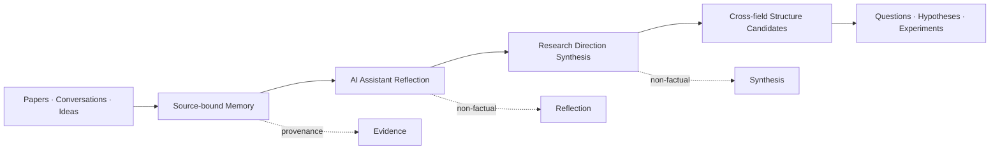

<p align="center">
  
</p>

<h1 align="center">Galois</h1>

<p align="center">
  <strong>Find the hidden structure.</strong><br />
  <em>Scientific memory for AI assistants.</em>
</p>

<p align="center">
  Galois helps AI assistants preserve evidence, evolve knowledge,<br />
  and discover meaningful structures across papers, conversations,<br />
  experiments, and ideas.
</p>

<p align="center">
  <a href="#connect-your-ai-assistant">Connect an assistant</a>
  &nbsp;·&nbsp;
  <a href="#how-it-works">How it works</a>
  &nbsp;·&nbsp;
  <a href="#why-galois">Why Galois</a>
  &nbsp;·&nbsp;
  <a href="#documentation">Documentation</a>
</p>

<p align="center">
  <code>Claude</code>
  &nbsp;·&nbsp;
  <code>Codex</code>
  &nbsp;·&nbsp;
  <code>Hermes</code>
  &nbsp;·&nbsp;
  <code>OpenClaw</code>
  &nbsp;·&nbsp;
  <code>OpenHuman</code>
  &nbsp;·&nbsp;
  <code>MCP</code>
</p>

---

Your AI can read thousands of documents.

It still struggles to remember **why** an idea was believed, **how** it changed,
and whether a connection is evidence-backed or merely interesting.

**Galois is a shared, local-first scientific memory for humans and AI assistants.**

| | | | |
|:---:|:---:|:---:|:---:|
| **Remember** | **Reflect** | **Connect** | **Verify** |
| Preserve sources, claims, and belief history | Digest new material into explicit reflections | Find candidate structures across research fields | Keep evidence, interpretation, and hypotheses separate |

> **Agents think. Galois remembers. Evidence decides.**

---

## What can Galois do?

**Build an evolving scientific memory**  
Papers, articles, conversations, experiments, ideas, and Agent sessions enter
one shared memory without losing their original provenance.

**Help assistants understand what changed**  
New material can support, refine, limit, contradict, or supersede existing
knowledge. Previous states remain auditable.

**Organize research by direction — not by folder or calendar**  
Galois maintains long-lived research directions such as world models,
reinforcement learning, dexterous manipulation, Kakeya geometry, Hilbert VI,
and gravity–entropy.

**Surface hidden structures across fields**  
A connection is not accepted because two documents share keywords.
A useful candidate must identify:

- the shared mechanism
- where the connection applies
- how the domains differ
- counterarguments
- missing evidence
- a path to verification

**Turn patterns into better questions**  
Direction synthesis can surface tensions, open questions, possible experiments,
and falsifiable hypothesis candidates — without presenting them as established
facts.

---

## Connect your AI assistant

Galois is designed to be used **through your assistant**, not as a
terminal-first knowledge manager.

Once connected, ask naturally:

```text
Use my Galois memory to answer this question and preserve the evidence boundary.
```

```text
Compare my world-model and Hilbert VI research directions.
What shared mechanism is worth investigating?
```

```text
Find a non-obvious connection across my recent papers.
Show the supporting sources, boundary, differences, evidence gap,
and the next verification step.
```

```text
Remember this research note: skill compilation may be the embodied
equivalent of JIT optimization.
```

> Retrieval is read-only by default. Capture requires explicit user intent
> and an opt-in assistant configuration.

### Supported hosts

| Assistant | Integration |
|---|---|
| Claude Desktop | Read-only MCP installer and config fragment |
| Codex | MCP config and explicit personal plugin workflow |
| Hermes | Read-only MCP config fragment |
| OpenClaw | Read-only MCP server fragment |
| OpenHuman | Generic MCP bridge configuration |
| Other assistants | Any compatible MCP client |

Host templates live in [`adapters/hosts/`](adapters/hosts/).

<details>
<summary><strong>One-time local setup</strong></summary>

<br />

Python 3.11–3.13 is supported.

```bash
git clone https://github.com/bhneo/global_memory.git
cd global_memory
python -m pip install -e ".[pdf]"
```

For Claude Desktop on Windows:

```powershell
.\scripts\install-claude-desktop-mcp.ps1
```

Other hosts can use the reviewed fragments in
[`adapters/hosts/`](adapters/hosts/).

The current package and CLI still use `global-memory-local`, `global_memory`,
and `gm` while the public identity transitions to **Galois**.

</details>

---

## How it works



**The assistant performs the cognition.**  
Galois does not call a model inside the memory core. Your connected assistant
reads, compares, reflects, and synthesizes. Galois provides bounded context,
validates the resulting artifact, preserves its sources, and applies only
permitted writes.

**Daily reflection**  
A connected assistant digests a small set of new inputs and decides whether
each candidate should:

`create` · `update` · `reuse` · `remain source-only` · `require review` · `defer`

This prevents valuable material from silently disappearing.

**Direction synthesis**  
Recurring synthesis follows stable research directions rather than arbitrary
calendar weeks. It asks: *What changed in this research direction?*

**Cross-direction synthesis**  
Cross-field connections are optional and evidence-bounded. A valid run may
produce **zero connections**. Rejecting a weak analogy is a successful outcome.

---

## Why Galois?

| Typical AI memory | Galois |
|---|---|
| Remembers extracted facts | Preserves Sources, evidence, interpretation, and belief history |
| Retrieves semantically similar text | Retrieves governed knowledge and active research directions |
| Rewrites old facts | Records support, refinement, limits, contradiction, and supersession |
| Generates attractive analogies | Requires mechanism, boundary, difference, counterarguments, and verification |
| Treats memory as model context | Separates research context from execution-safe context |
| Belongs to one assistant | Can be shared across multiple assistants |
| Model confidence becomes authority | Canonical knowledge remains human-controlled |

---

## Trust without killing creativity

Galois separates creative cognition from factual authority.

```text
Source → Working → Trusted → Canonical
           ↑
Reflection and Synthesis remain explicitly non-factual
```

| Tier | Role |
|---|---|
| **Working** | Active knowledge under development |
| **Trusted** | Evidence-backed and policy-qualified |
| **Canonical** | Explicitly approved by the user |
| **Historical** | Superseded knowledge retained for audit |

Questions, analogies, tensions, reflections, and hypotheses can remain valuable
for years without being mislabeled as facts.

---

## Agent Memory Gateway

Connected assistants receive bounded Evidence Packets through MCP.

The gateway can expose:

- connected research context
- evidence search
- individual knowledge objects
- original Source material
- explicit-consent capture
- optional session, use, and feedback signals

It preserves epistemic status, evidence quality, contradictions, and execution
safety while hiding storage paths and maintenance internals.

The default gateway is **read-only**.

---

## Current capabilities

| Memory | Cognition | Integration |
|---|---|---|
| Local-first Markdown truth layer | Agent-driven Daily Reflection | MCP for multiple assistants |
| Immutable Raw / Source capture | Research-direction Synthesis | Obsidian views & semantic graph |
| Working / Trusted / Canonical / Historical | Cross-direction Synthesis | Recovery, migration, drift audit |
| Evidence & provenance tracking | Falsifiable hypothesis gates | Research / exploration / execution profiles |
| Explicit belief evolution | Evidence-bounded connections | Integrity checks |

---

## What Galois is not

- Not an automatic truth machine
- Not a generic note-taking app
- Not a vector database wrapper
- Not a general Agent runtime
- Not a multi-Agent orchestrator
- Not an automatic experiment executor
- Not a replacement for primary sources
- Not a system that turns every analogy into a discovery

---

## Project status

Galois is experimental research infrastructure and is actively used on a real,
multi-domain research vault.

Before a formal open-source release, the project is preparing:

- a clean demonstration vault
- portable assistant setup
- reproducible reflection and synthesis examples
- public evaluations
- cross-platform onboarding
- a formal open-source license

---

## Documentation

| | |
|---|---|
| [Vision](docs/VISION.md) | [Architecture](docs/ARCHITECTURE.md) |
| [Cognitive consolidation](docs/COGNITIVE_CONSOLIDATION.md) | [Research directions](docs/RESEARCH_DIRECTIONS.md) |
| [Agent integration](docs/AGENT_INTEGRATION.md) | [MCP integration](docs/MCP_INTEGRATION.md) |
| [Memory consolidation](docs/MEMORY_CONSOLIDATION.md) | [Semantic distillation](docs/SEMANTIC_DISTILLATION.md) |
| [Current project state](PROJECT_STATE.md) | |

---

## License

No open-source license has been selected yet.

Until a `LICENSE` file is added, the repository should not be treated as
licensed for reuse or redistribution.

---

<p align="center">
  <br /><br />
  <strong>Find the hidden structure.</strong><br />
  Preserve the evidence. Connect the ideas. Ask a better question.
</p>
